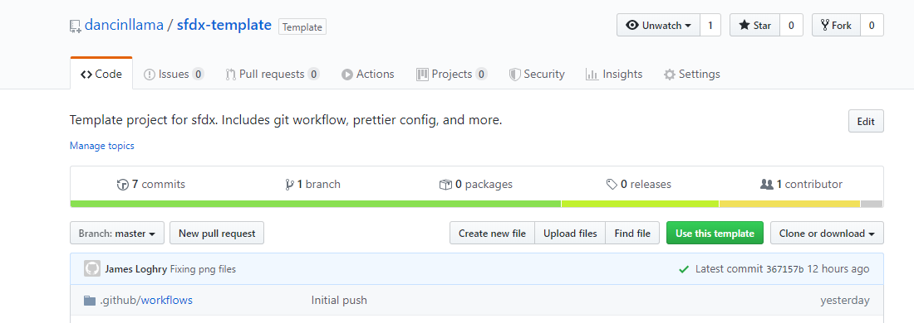
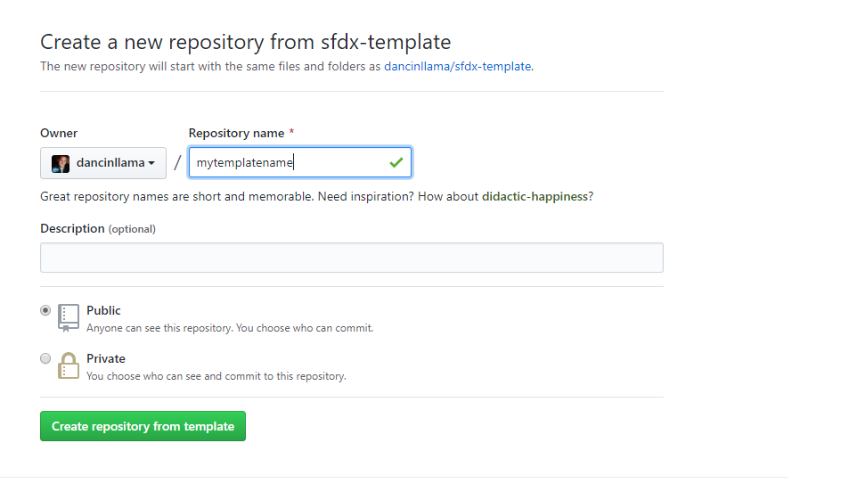
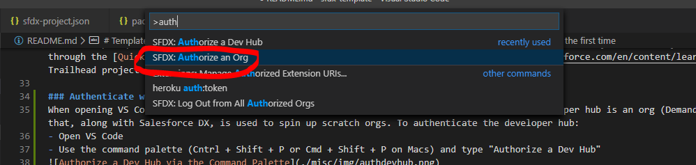
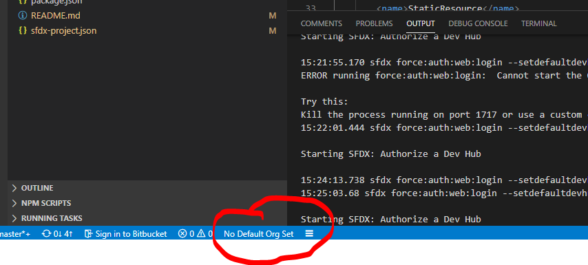

# Template for SFDX Projects

## Build Status

## Deploy to a Scratch Org

## Table of Contents

-   [Description](#description)
-   [Getting started with this template](#getting-started-with-this-template)
-   [Starting with VS Code](#starting-with-vs-code)
    -   [Authenticate with the Developer Hub](#authenticate-with-the-developer-hub)
    -   [Working with an existing Salesforce org for the first time](#working-with-an-existing-salesforce-org-for-the-first-time)
    -   [Working with a file](#working-with-a-file)
    -   [Commiting Files to Source Control](#commiting-files-to-source-control)
-   [Recommended Visual Studio Code Extensions](#recommended-visual-studio-code-extensions)
-   [Recommended Git Clients](#recommended-git-clients)

## Description

This repository is a template for SFDX projects. It includes the following:

-   Hooks for when you commit your code.

    -   Validates via PMD / static code analyzer that you're following Salesforce development best practices and security.
    -   Formats your code for you, using prettier.

-   Continuous Delivery (CD) support with git actions.
    -   See: .github/push.yml
    -   Runs static code analyzer on push to the repository.
    -   Automatically prettifies Lightning Web Components, Lightning Components, Apex, Visualforce and more, and commits the updates.

## Getting started with this template

-   Copy the template to a new repository

    -   Click on `Use this template` button on the sfdx-template repository home page

    

    -   Fill in the desired information on the new repository form.

    

*   Clone that repository to your local workspace.

    -   Use your git client of choice (VS Code extension, Source Tree, or the git CLI)
    -   The repository url will be the format: https://github.com/username/repository_name.git

*   In order to run the commit hooks:

    -   Download and install node from here: https://nodejs.org/en
    -   Open your command prompt or terminal.
    -   From your repository directory, run the following command: `npm install`

    > This will install several node modules in the folder where you cloned your repository. It will also install "husky", which is used for invoking commands when you commit code back to the remote repository / github. The default husky config (found in package.json) will lint aura components as well as run apex-pmd, which validates your Apex code and more.

## Starting with VS Code

Now that you've created a repository, it's time to put something in it and start down the source control journey. This step assumes you have already installed the Salesforce DX CLI, downloaded Visual Studio Code, and set up the Salesforce extensions.

> 
> This step requires the Salesforce DX CLI, Visual Studio Code, and Salesforce VS Code extensions. If you have not yet set up Visual Studio Code, please go through the [Quick Start: Visual Studio Code for Salesforce Development](https://trailhead.salesforce.com/en/content/learn/projects/quickstart-vscode-salesforce) Trailhead project

### Authenticate with the Developer Hub

When opening VS Code for the first time, you'll want to authorize the developer hub. The developer hub is a regular Salesforce org (your production org for instance), that has the Dev Hub permission enabled and along with Salesforce DX, is used to spin up scratch orgs. To authenticate the developer hub:

-   Open VS Code
-   Use the command palette (Cntrl + Shift + P or Cmd + Shift + P on Macs) and type "Authorize a Dev Hub"
    
-   This will open your default browser to login.salesforce.com (as configured in `sfdx-project.json`). Log in with your Salesforce credentials.
-   Authorize the app, if prompted.

### Working with an existing Salesforce org for the first time

If you're getting started on a project where there's an existing code base, then read you'll want to read on and do the following:

-   In VS Code, open the repository you just created.
    -   Go to File->Open Folder
    -   Navigate to your workspace directory (such is C:\Users\James\workspace)
    -   Single-click on the project folder
    -   Click `Select folder` to open the project.
-   Authorize the org. (This is similar, but different from authorizing the dev hub)

    -   Use the command palette (Cntrl + Shift + P or Cmd + Shift + P on Macs) and type "Authorize an Org"
        
    -   This will open a secondary menu to select project default, production, sandbox, or custom url.
        > You'll likely want to select sandbox or possibly production or custom url. Make sure to select the proper choice here.
    -   Specify a name / alias for the org. This can be anything, but should be descriptive.
    -   Your browser will open to the domain you chose.
    -   Log in with username and password.
    -   Authorize the DX application if prompted.
    -   Close the tab / window.

    

    -   The bottom bar in VS code has a few nifty easter eggs, including an indication of what org Visual Studio and Salesorce related commands will run against. This should be set automatically when you authorize an org. However, if your status bar shows "No Default Org Set", like mine does below, no worries! Use the command palette (Cntrl + Shift + P or Cmd + Shift + P and type in "Set a Default Org", and look for the org that you authorized earlier

    

    -   After you have a default org set, the next step is to bring down the source code.
    -   This repository template comes with a pre-defined package.xml, that will bring down most everything from the org.
    -   If needed, edit `manifest/package.xml` to change the metadata that is pulled from the org.
    -   Next, in VS Code, find the manifest/package.xml, and right click (or cntrl click on mac?), and select "Retrieve Source in Manifest from Org"

    

### Working with a file

Now it's time to edit a file. Open a file from the explorer or use the shortcut `Cntrl + P` or `Cmd + P` and search for the file. By default, once you save the file, it is NOT deployed to Salesforce right away. If you're working with a sandbox, developer edition, or other type of org that is NOT a scratch org, you will need to `Deploy this Source to Org` from either the file explorer or via the command palette. This only deploys the file you currently have open or have selected in the file explorer.

### Commiting Files to Source Control

If you're ready to commit the file to source control, you have a few options. The best options are using a tool called Source Tree (it's an Atlassian product), or using the out of the box git extension in VS Code, or my favorite is to just use the CLI interface. However, we'll quickly walk through how works in VS Code, but first we need a quick Git primer.

#### Git Primer

When you check stuff into github or bitbucket or other git services, you're really dealing with 2 repositories, your local repository and typically a cloud-hosted or remote repository. You can totally get by with just a local repository, but for working in the same repository as a team, then you'll also need a cloud-hosted service such as GitHub.

When you download a repository from a remote repo, such as one stored in github, it's called `cloning a repository`, and creates a point in time copy of the source on your local workspace. When you start editing files, they become untracked changes and show up in your VS Code git extension as a little notice. In the screenshot below, I have 9 changes or changes I've made that differ from what my local repository is expecting.

From this git extension, you can also start staging my changes for a commit. For instance, you can select all of your changes and right click or cntrl click, and select "Stage changes", which tells your local repository that you are about to commit changes.

Once you're ready to commit the staged changes, select the files you'd like to commit and click the checkmark icon (seen in the picture below) to commit them. Make sure to provide a short, but descriptive commit message to go along with the commit. If you're committing files related to an agile user story for instance, you should use the story id / number in the commit message.

After commit the changes to your local repository, the final step is to push them up to the remote repository.

## Recommended Visual Studio Code Extensions

Below are a few of my favorite extensions for Visual Studio Code. These extensions can be installed via the market place within VS Code.

-   Salesforce Extension Pack (of course!)
-   Salesforce Documenter (for adding documentation headers to Apex classes, triggers, LWCs, etc.)
-   Apex PMD (for analyzing your Salesforce code. This is also part of the commit hooks and git workflow)
-   Prettier - Code Formatter (for formatting code)
-   Trailing Spaces (for highlighting and deleting those pesky spaces at the end of lines)
-   heroku cli (For working with heroku apps)
-   ESLint (for linting JavaScript files and Lightning Web Components)
-   Markdown Preview Github Styling (for working with github README files)

## Recommended Git Clients

The following can be used for working with Git

-   Source Tree (very nice, intuitive interface https://www.sourcetreeapp.com/)
-   The VS Code extension (should come with vscode)
-   Terminal / CLI (quick and easy for simple tasks, not very good for comparing code or complicated tasks)
